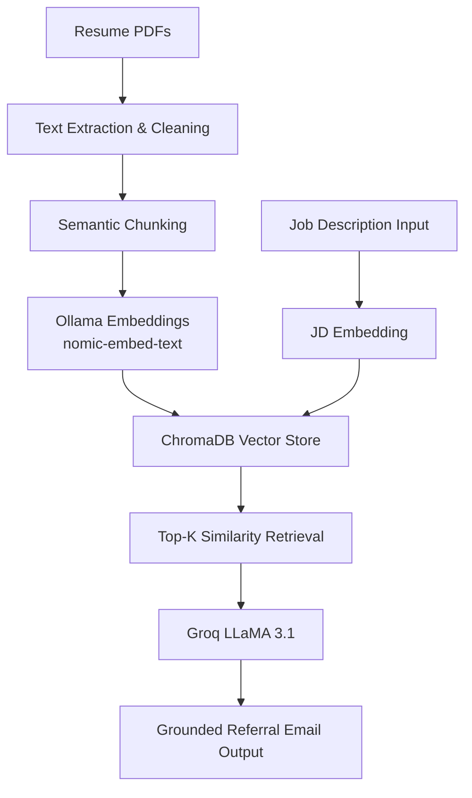
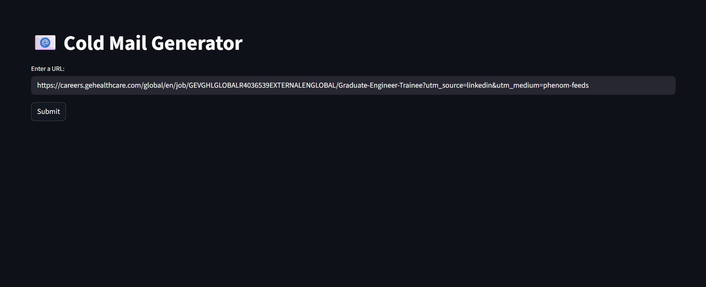
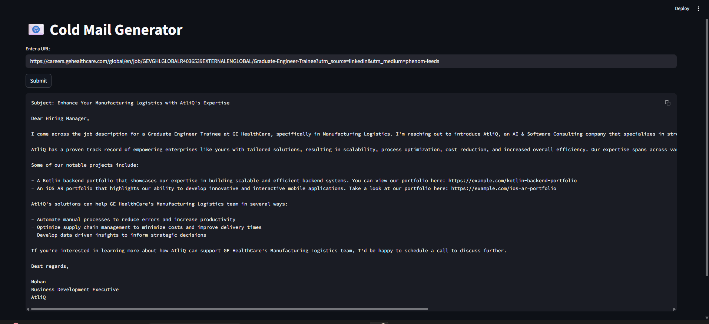

# RAG-Based Personalized Referral Email Generator

## Overview

This project implements a **Retrieval-Augmented Generation (RAG)** system that generates **personalized, fact-grounded referral request emails** using structured resume data.

Unlike generic LLM email generators, this system retrieves **semantically relevant resume evidence** using vector similarity search and grounds the LLM response strictly in retrieved context — significantly reducing hallucinations and ensuring factual consistency.

The system uses **ChromaDB** for vector storage, local embeddings via **Ollama**, and fast inference using **Groq LLaMA 3.1**.

---

## Problem Statement

Cold outreach and referral emails often:

- Sound generic and templated  
- Exaggerate or fabricate experience  
- Fail to align with the job description  
- Lack personalization  

Pure LLM-based generation frequently introduces hallucinated achievements.

---

## Solution

This system uses a **RAG pipeline**:

- Parse resume PDFs  
- Generate embeddings  
- Store embeddings in ChromaDB  
- Retrieve relevant resume snippets using semantic search  
- Generate strictly grounded referral emails  

This ensures:

- No fabricated internships or companies  
- Evidence-backed personalization  
- Job-aligned messaging  
- Professional tone  

---

## System Architecture



---

## Architecture Explanation

### 1. Ingestion Layer
- Extracts and cleans resume text
- Splits content into semantic chunks
- Generates embeddings using Ollama

### 2. Vector Store Layer
- Stores embeddings in **ChromaDB**
- Supports fast similarity-based retrieval
- Enables multi-resume indexing

### 3. Retrieval Layer
- Converts Job Description into embedding
- Retrieves top relevant resume chunks
- Passes retrieved evidence to LLM

### 4. Generation Layer
- LLM prompt constrained to:
  - Use only retrieved context
  - Avoid fabrication
  - Maintain structured format
- Outputs grounded referral email

---

## Key Features

- Retrieval-Augmented Generation (RAG)
- Multi-resume semantic search
- Hallucination control via strict prompting
- Role-based contextual retrieval (SDE / AI / Backend)
- Evidence-backed email generation
- Local embeddings via Ollama
- Vector storage powered by ChromaDB
- Fast inference using Groq API
- Modular backend architecture

---

## Tech Stack

### Vector Database
- ChromaDB

### Embeddings
- Ollama (`nomic-embed-text`)

### LLM
- Groq API (`llama-3.1-8b-instant`)

### Backend
- Python

### UI
- Streamlit

### Libraries
- PyPDF
- ChromaDB
- Requests
- Streamlit
- Groq SDK

---

## How It Works

1. Resume PDFs are parsed and cleaned.
2. Text is split into semantically meaningful chunks.
3. Each chunk is converted into embeddings.
4. Embeddings are stored in ChromaDB.
5. User provides job description.
6. System retrieves top relevant resume snippets.
7. LLM generates referral email strictly grounded in retrieved evidence.

---

## Reliability & Guardrails

- LLM restricted to retrieved context
- No resume evidence = no generation
- Deterministic Top-K retrieval
- Structured prompt template
- Evidence displayed before output
- Modular separation of ingestion, retrieval, and generation

---

## Project Structure

```
rag-referral-email-generator/
│
├── app/
│   ├── ingest_resume.py
│   ├── retrieve.py
│   ├── generate_email.py
│   ├── scrape_job.py
│   ├── main.py
│   ├── ui.py
│   └── profile.json
│
├── screenshots/
├── requirements.txt
└── README.md
```

---
## System UI

### Main Interface



### Generated Email Output


## Setup Instructions

### 1. Clone Repository

```bash
git clone <repo-link>
cd rag-referral-email-generator
```

### 2. Install Dependencies

```bash
pip install -r requirements.txt
```

### 3. Start Ollama

```bash
ollama serve
ollama pull nomic-embed-text
```

### 4. Ingest Resume

```bash
python app/ingest_resume.py
```

### 5. Run UI

```bash
streamlit run app/ui.py
```

---

## Example Workflow

1. Upload resume
2. Paste job description
3. System retrieves top evidence
4. Generates grounded referral email
5. User reviews before sending

---

## Results

- Factual email generation
- No hallucinated experiences
- Relevant projects highlighted first
- Low-latency local embedding pipeline
- Scalable to multi-resume workflows

---

## Future Improvements

- Skill gap analysis
- Resume optimization suggestions
- Confidence scoring for retrieval
- Email export as PDF
- Logging and audit trail
- Multi-agent orchestration

---

## Author

Rakshitha Chandrashekar

---

## License

For academic and portfolio use.
